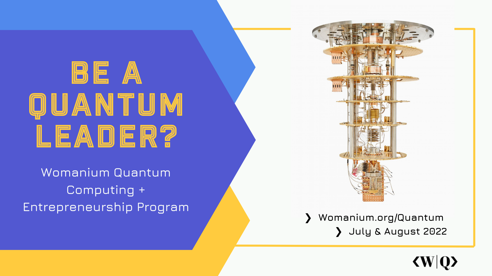
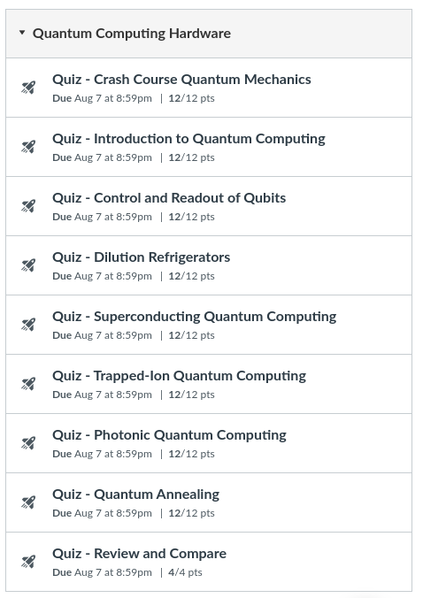

# Quantum Computing Hardware 

July 10 - Aug 7, 11am-1pm US ET.

The full schedule can be found [here](Womanium%20Quantum%20-%20Program%20Schedule.pdf).

The lecture videos can be found [here](https://www.youtube.com/playlist?list=PL_wGNAk5B0pWJqVoMwVVeY1gAFctx3aWH).

## Certificate conditions:
* Pass each Canvas quiz with a passing score >50%
* Have an average quiz score of >70% for the entire module
* Complete the module by Aug 7

The full report can be found [here](Womanium_grades.pdf).
